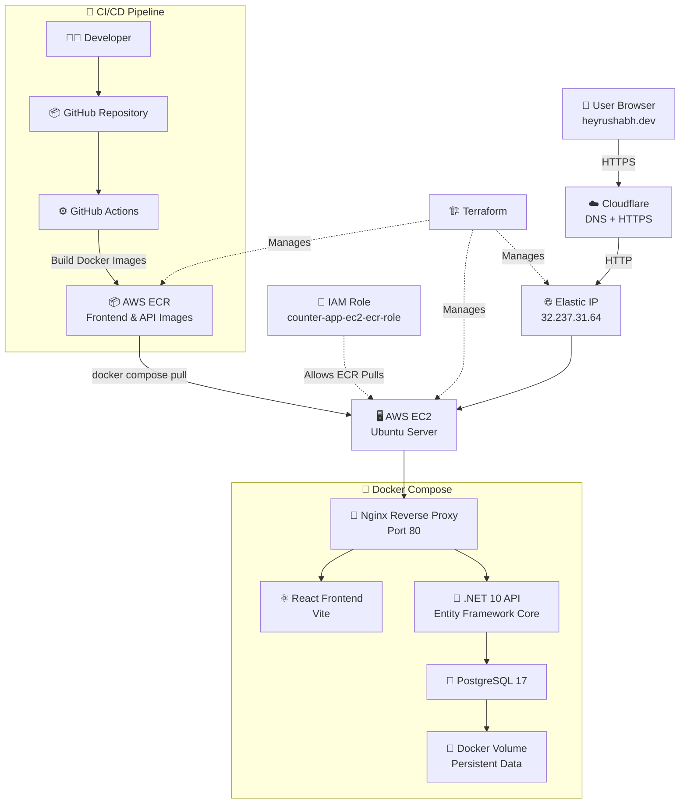

# CounterApp- Operations and Architecture Guide


## 1. Application URL

- Website: `https://heyrushabh.dev`
- Website: `https://www.heyrushabh.dev`


## 2. How the Application Works

```text
User
  ↓
heyrushabh.dev
  ↓
Cloudflare DNS and HTTPS
  ↓
AWS Elastic IP
  ↓
EC2
  ↓
Frontend Nginx container on port 80
  ├── /        → React frontend
  └── /api/*   → .NET API container on internal port 8080
                    ↓
                 PostgreSQL container on internal port 5432
```

### Request flow

1. A visitor opens `heyrushabh.dev`.
2. Cloudflare sends the request to the EC2 Elastic IP.
3. EC2 port 80 sends the request to the frontend Nginx container.
4. Nginx serves the React website.
5. When the visitor presses the button, React calls `/api/Counter/increment`.
6. Nginx forwards `/api/*` requests internally to the API container at `api:8080`.
7. The API contacts PostgreSQL internally at `postgres:5432`.
8. PostgreSQL saves the number in the persistent Docker volume.
9. The updated number returns through the API and Nginx to the browser.

## 3. Technology Stack

```text
Frontend:        React and Vite
Backend:         .NET 10 Web API
Database:        PostgreSQL 17
ORM:             Entity Framework Core
Web server:      Nginx
Containers:      Docker and Docker Compose
Container store: AWS ECR
Cloud:           AWS EC2
Infrastructure:  Terraform
CI/CD:           GitHub Actions
DNS and HTTPS:   Cloudflare
Source control:  GitHub
```

## 4. AWS Infrastructure

Terraform manages:

```text
VPC
Public subnet
Internet gateway
Route table
Security group
EC2 instance
Elastic IP
IAM role and instance profile
ECR repositories
```

### Important AWS resources

```text
Region:              ap-southeast-2
API ECR repository:  dotnet-counter-api
Web ECR repository:  dotnet-counter-frontend
EC2 IAM role:        counter-app-ec2-ecr-role
```

The EC2 IAM role allows the server to request temporary credentials and pull private images from ECR. No permanent AWS access key is stored on EC2.

## 5. Public and Internal Ports

```text
Port 22    SSH administration
Port 80    Public website and Nginx reverse proxy
Port 443   HTTPS when terminated at the origin, if configured later
Port 8080  Internal .NET API port
Port 5432  Internal PostgreSQL port
```

Only services that must be contacted from outside Docker need host port mappings.

- Nginx must be reachable publicly.
- The API can remain internal because Nginx forwards `/api` requests to it.
- PostgreSQL can remain internal because only the API needs it.

## 6. Docker Compose Services

```text
frontend
  Image: ECR frontend image
  Runs:  Nginx and React

api
  Image: ECR API image
  Runs:  .NET 10 API

postgres
  Image: postgres:17
  Stores data in a named Docker volume
```

### Persistent database data

PostgreSQL uses a named volume similar to:

```text
dotnet-counter-app_postgres-data
```

Safe command:

```bash
docker compose down
```

Dangerous command that also deletes the database volume:

```bash
docker compose down -v
```

Do not use `-v` unless intentionally resetting the database.

## 7. CI/CD Flow

### Build workflow

```text
Git push
  ↓
Build .NET API
Build React frontend
Build API container image
Build frontend container image
Push both images to AWS ECR
```

### Deployment workflow

The deployment workflow is manually triggered from GitHub Actions.

```text
Run deploy workflow
  ↓
GitHub Actions connects to EC2 through SSH
  ↓
EC2 logs in to ECR using its IAM role
  ↓
docker compose pull
  ↓
docker compose up -d
  ↓
Unused Docker images are pruned
```

## 8. Database Migrations

The API automatically runs Entity Framework Core migrations during startup.

```text
API starts
  ↓
Waits and retries if PostgreSQL is not ready
  ↓
Checks migration history
  ↓
Applies missing migrations
  ↓
Starts serving API requests
```

This prevents the earlier `relation "Counters" does not exist` problem in a fresh environment.

## 9. Daily Start and Stop Guide

### Stop the environment to reduce cost

In the AWS Console:

```text
EC2 → Instances → Select the counter instance → Instance state → Stop instance
```

Do not run `terraform destroy` unless intentionally deleting the environment.

### Start the app for a demonstration

1. Start the EC2 instance in the AWS Console.
2. Wait until the instance reports successful status checks.
3. Open `https://heyrushabh.dev`.
4. If the page is unavailable, connect to EC2 and run:

```bash
cd ~/dotnet-counter-app
docker compose up -d
```

Because the instance has an Elastic IP, the domain does not need to be updated after a normal stop and start.

## 10. Important Troubleshooting Commands

### Check all running containers

```bash
docker ps
```

### Check all containers, including stopped ones

```bash
docker ps -a
```

### Check Compose status

```bash
cd ~/dotnet-counter-app
docker compose ps
```

### View API logs

```bash
docker logs dotnet-counter-app-api-1 --tail 100
```

### View frontend logs

```bash
docker logs dotnet-counter-app-frontend-1 --tail 100
```

### View PostgreSQL logs

```bash
docker logs postgres --tail 100
```

### Pull and run the latest ECR images

```bash
cd ~/dotnet-counter-app
docker compose pull
docker compose up -d
docker image prune -f
```

### Check the image used by a container

```bash
docker inspect dotnet-counter-app-api-1 --format='{{.Config.Image}}'
docker inspect dotnet-counter-app-frontend-1 --format='{{.Config.Image}}'
```

### Check PostgreSQL manually

```bash
docker exec -it postgres psql -U postgres -d counterdb
```

Inside PostgreSQL:

```sql
\dt
SELECT * FROM "Counters";
\q
```

### Test Nginx reverse proxy

```bash
curl http://localhost/api/Counter
```

### Test API internally from EC2

```bash
curl http://localhost:8080/Counter
```

### Check EC2 AWS identity

```bash
aws sts get-caller-identity
```

### Check Git state

```bash
git status
git log --oneline -5
```

## 11. Common Problems

### Website unavailable after EC2 starts

```bash
cd ~/dotnet-counter-app
docker compose up -d
docker compose ps
```

### API container exits during startup

Check:

```bash
docker logs dotnet-counter-app-api-1 --tail 100
```

Typical causes:

- PostgreSQL is not ready yet
- Database connection settings are incorrect
- Migration failed

### `/api/Counter` returns an Nginx 404

Check whether the custom Nginx configuration exists inside the running container:

```bash
docker exec -it dotnet-counter-app-frontend-1 cat /etc/nginx/conf.d/default.conf
```

The configuration must contain a `/api/` location that proxies to `api:8080`.

### EC2 cannot pull ECR images

Confirm the IAM role:

```bash
aws sts get-caller-identity
```

Refresh Docker's temporary ECR login token:

```bash
aws ecr get-login-password --region ap-southeast-2 | docker login --username AWS --password-stdin 123677443445.dkr.ecr.ap-southeast-2.amazonaws.com
```

Then retry:

```bash
docker compose pull
```

### Frontend changes are not visible

1. Confirm the build workflow pushed a new frontend image.
2. Run the deployment workflow.
3. Hard-refresh the browser with `Ctrl + Shift + R`.
4. Check which image the frontend container is running.

## 12. Safe Git Workflow

Before a change:

```bash
git pull --rebase origin main
```

After testing locally:

```bash
git status
git add <specific-files>
git diff --staged
git commit -m "Describe the change"
git push
```

For frontend testing:

```bash
cd frontend
npm install
npm run dev
```

Production-style frontend build test:

```bash
npm run build
npm run preview
```

## 13. Cost and Safety Reminders

- Stop EC2 when the application is not needed.
- Do not leave an unattached Elastic IP allocated.
- Do not run `terraform destroy` unless intentionally removing the environment.
- Do not run `docker compose down -v` unless intentionally deleting PostgreSQL data.
- Never commit `.pem` files, AWS keys, passwords, or Terraform state to GitHub.
- Keep deployment secrets in GitHub Environment or Repository Secrets.
- Review every `terraform plan` before approving an apply.

## 14. Next Improvement Ideas

```text
Docker health checks
CloudWatch monitoring and alerts
Git SHA image tags instead of latest
ECR image lifecycle policies
PostgreSQL backups
Cloudflare Full (Strict) encryption or AWS ACM later
ECS/Fargate migration
RDS PostgreSQL migration
Automated rollback strategy
```

---

## One-Sentence Project Summary

CounterApp is a React and .NET 10 application backed by PostgreSQL, containerized with Docker, provisioned through Terraform, built and deployed by GitHub Actions, stored in AWS ECR, hosted on EC2 behind Nginx, and exposed through Cloudflare DNS and HTTPS.
